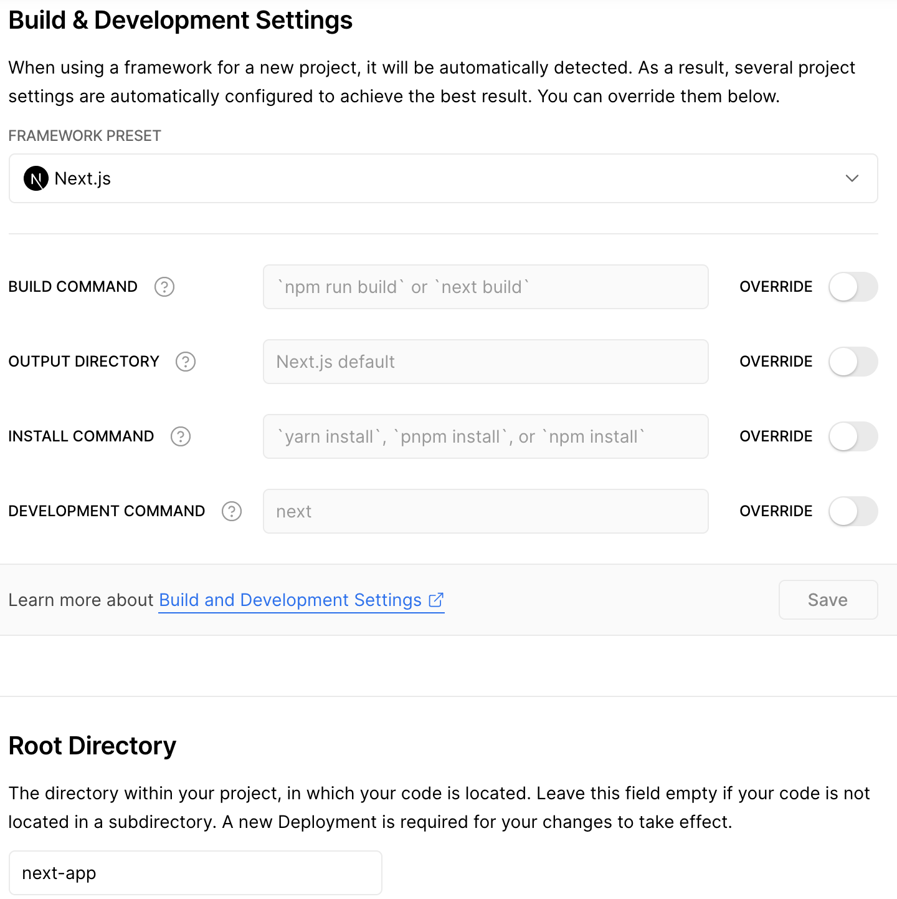

# Redwood/Next Example App

## Welcome to Hogwarts School of Witchcraft and Wizardry! 🧙‍♂️

This example app is a school registration system using [Redwood Web](https://redwoodjs.com/docs/tutorial/chapter1/file-structure#the-web-directory) for admin interface, [Redwood Api](https://redwoodjs.com/docs/tutorial/chapter1/file-structure#the-api-directory) for all backend code, and [Next.js](https://nextjs.org/) for user interface.

The composability and flexibility of Redwood allows you to integrate with custom sides like Next.js and take advantage of SSR, ISR, and much more.

**View the deployed [Redwood App](redwood-next-example-app-next.vercel.app) and [Next.js App](https://redwood-next-example-app-next.vercel.app/)**

### Example App File Structure

```
example-app/
├─ api/
│  ├─ db/
│  ├─ src/
│  ├─ types/
│  ├─ package.json
├─ web/
│  ├─ src/
│  ├─ types/
│  ├─ public/
│  ├─ package.json
├─ next-app/
│  ├─ components/
│  ├─ pages/
│  ├─ graphql-client/
│  ├─ types/
│  ├─ package.json
│  ├─ next.config.js
├─ package.json
├─ README.md

```

## Redwood API

### Data Model

- `Wizard`: Hogwarts student with first name, last name, and if they are sorted, a house.
  - **RW web admin interface:** CRUD wizard
  - **Next.js user interface:** CR wizard
- `Classroom`: A class that contains wizards, spells taught in that class, and ingredients to prepare for that class. i.e Potions
  - **RW web admin interface:** CRUD classes
  - **Next.js user interface:** only view classes, wizards can enroll in a class
- `Ingredients`: Things and Curiosities that exists in the wizard world i.e Newt spleens, Stewed Mandrake. Seeded in database
  - **RW web admin interface:** only view and select ingredients
  - **Next.js user interface:** only view ingredients associated with a class
- `Houses`: 4 Hogwarts Houses with name, founder, ghost, and other details.
  - **RW web admin interface:** Seeded in database
  - **Next.js user interface:** Once wizard is created, can get sorted into a house

### Data

Certain data is seeded from JSON file of houses, ingredients, spells, wizards in the `/data` folder. The script to seed the data is found in `scripts/seed.ts`. If running this project for the first time locally, run `yarn rw prisma db seed`

## Redwood Web and Next.js frontend

### Styling

Sorry for the bad design! Most components are styled using [Material UI](https://mui.com/).

### Types

Redwood automatically [generates types](https://redwoodjs.com/docs/typescript#auto-generated-types) for your GraphQL queries, routes, Cells, scenerios, and tests. You can find the generated types in the `redwood/types`, `web/types/graphql.d.ts`, and `api/types/graphql.d.ts` directories.

To take advantage of the web GraphQL types in your Next.js front end app, there are a few options:

1. [Used in this app] Create a type-gen script in `scripts/type-gen.sh` that generates types and copies over the types from `web/types/graphql.d.ts` to `next-app/types/graphql.d.ts`.

2. In your next-app `tsconfig.json`, you can set the following options to allow next-app to pick up types stored in the `web/types/graphql.d.ts` file:
   - `compilerOptions.rootDirs = ["next-app", "web"]`
   - `compilerOptions.paths = ["./types/*"]`,
   - `compilerOptions.typeRoots: ["../node_modules/@types", "./node_modules/@types", "../web/types/*"],`
   - `include:["next-env.d.ts", "**/*.ts", "**/*.tsx", "../web/types/*"]`

- In `next.config.js`: also set `experimental.externalDir = true`. More details [here](https://github.com/vercel/next.js/pull/22867) and [here](https://github.com/vercel/next.js/discussions/26420|Discussion)

Note: All type files are not tracked by git. In option 2, you might run into issues during deployment when your components in next-app are trying to import types from web. So you can remove `web/types/graphql.d.ts` from gitignore.

## Git it Running

In development, `yarn run dev` will run both Redwood and Next.js. This command will run `next dev` and `yarn redwood dev` concurrently.

Ports:

- Next.js: 3000
- Redwood web: 8910
- Redwood api: 8911

## Deployment

This app was deployed with Vercel.

When deploying with Vercel, only option 1 of using a script to copy types from `web/types/graphql.d.ts` will work. Vercel is designed to detect `/api` as serverless functions. Therefore the `/next-app` can not be deployed individually from the root. On the other hand, when deploying from `/next-app` as the root, you do not have access to any files (i.e `graphql.d.ts`) outside of `/next-app`. Therefore, we have to copy over the types into the `/next-app` for reuse.

1. Deploy Redwood API/Web together with RedwoodJS preset and root directory as `./`
   

2. Deploy Next app with Next,js preset and root directory as `next-app`
   
